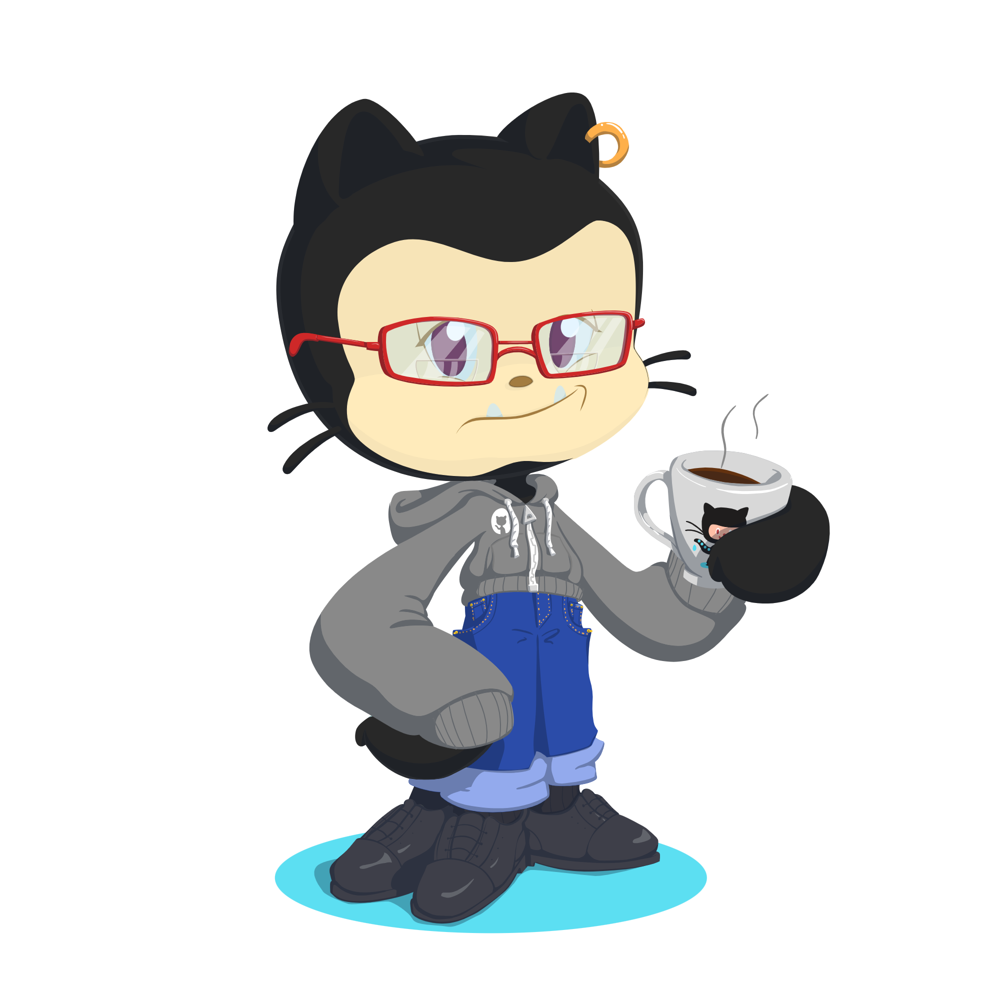

# Ola! 👋
# Evellyn Karla

 
  
Tenho 20 anos, moro em Pernambuco, Brasil e sou estudante de graduação. Sou comunicativa, conciliadora e animada, seja com amigos ou codando estou sempre empenhada com as atividades. Cursei técnico em TI e atualmente estou estudando ADS no 5º periodo. Fui finalista do DemoDay e uma das convocadas para a Arena Digital no Rec'n'Play, pelo projeto MOM! Atualmente estagiando na EDX, empresa do Extreme Group, com a plataforma ServiceNow. Estou utilizando essa oportunidade para crescer e aprender o máximo possível, e me tornar uma profissional mais preparada e competente.

## Tecnologias

## Conecte-se comigo
 

